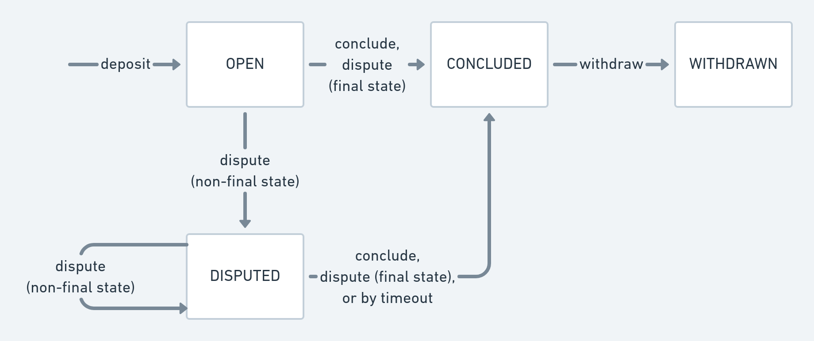

<h1 align="center">
    <a href="https://perun.network/"></a>
</h1>

[](https://github.com/perun-network/perun-icp-canister/actions/workflows/rust.yml)
[](https://www.apache.org/licenses/LICENSE-2.0.txt)

# Perun ICP Canister

This repository contains the Internet Computer canister for the [Perun state channel framework](https://perun.network) developed by [PolyCrypt](https://polycry.pt).
The canister is developed as part of the Dfinity grants program.
It contains the on-chain logic needed to operate payment channels on the internet computer.
In the future, it will connect to the [go-perun](https://github.com/hyperledger-labs/go-perun) client library so that applications can be written for it.

## :warning: Current Limitations

Currently, the canister only supports ICP tokens.
Once a token standard or ICP token interactions are live, the code can be easily
adapted to work with those.

Additionally, the client-side logic for our channel framework is not fully covered by this grant's scope.

## Protocol

A payment channel is a direct peer-to-peer protocol to allow two parties to exchange assets without involvement of the blockchain, besides when _opening_ or _closing_ the channel.
A channel is opened by depositing funds for it into the contract by calling `deposit`.
The participants of the channel can then do as many off-chain channel updates as they want.
A channel update is comprised of a new channel state together with signatures of
all channel participants of this new state.
Each channel state contains the balances of each user as well as a version
counter, which is incremented by one on each update.
When all participants come to the conclusion that the channel should be closed, they set the final flag on the channel state, and call `conclude`.
All of them can then withdraw the concluded channel outcome by calling `withdraw`.

A call to `dispute` is only needed if the participants do not arrive at a final channel state off-chain.
It allows any participant to enforce the last valid state, i.e., the mutually-signed state with the highest version number.
A dispute is initiated by calling `dispute` with the latest available state.
A registered state can be refuted within a specified challenge period by calling `dispute` with a newer state.
After the challenge period, the dispute can be concluded by calling `conclude` and the funds can be withdrawn.



## Test & Compile

```sh
cargo test --tests
./build.sh
```

You need to have the `wasm32-unknown-unknown` target installed, or the second
build command will fail. You can install it by running
`rustup target add wasm32-unknown-unknown`.

## Example Walkthrough

We provide an example to show how to use the [ic-agent] crate to deposit funds
into the *Perun* canister. You will need Rust `1.56` or later.

1. Start a replica locally and deploy the *Perun* canister to it:
```bash
dfx start --clean
dfx deploy # In a new terminal
```

2. Copy the *principal ID* from the terminal which looks like this: `rrkah-fqaaa-aaaaa-aaaaq-cai`.
Make sure to copy the *Perun* canister ID, **not** the UI canister ID.

3. [Issue #4881 of cargo] needs to be worked around here since the example
needs to link against the canister as native lib.
Change the `"cdylib"` in the [Cargo.toml] to `"lib"`.

4. Run the command below with the *Perun* canister ID that you copied:
```sh
RUST_LOG=info cargo run --example happy_walkthrough "rrkah-fqaaa-aaaaa-aaaaq-cai"
```
The output should look like this minus the comments:
```sh
INFO  happy_walkthrough > URL: http://localhost:8000/
INFO  happy_walkthrough > Canister ID: rrkah-fqaaa-aaaaa-aaaaq-cai
# Bob and Alice start with 0 ICP in the channel.
INFO  happy_walkthrough > Querying deposit channel: 0x920c7366… for peer IDx: 0, now: 0 ICP
INFO  happy_walkthrough > Querying deposit channel: 0x920c7366… for peer IDx: 1, now: 0 ICP
# Bob and Alice deposit 242 and 194 ICP in the channel.
INFO  happy_walkthrough > Depositing       channel: 0x920c7366… for peer IDx: 0, add: 242 ICP
INFO  happy_walkthrough > Depositing       channel: 0x920c7366… for peer IDx: 1, add: 194 ICP
# Bob and Alice now have 242 and 194 ICP in the channel.
INFO  happy_walkthrough > Querying deposit channel: 0x920c7366… for peer IDx: 0, now: 242 ICP
INFO  happy_walkthrough > Querying deposit channel: 0x920c7366… for peer IDx: 1, now: 194 ICP
# They exchange a state…
# Bob and Alice can conclude the channel with a final state.
INFO  happy_walkthrough > Concluding       channel: 0x920c7366…
# Bob and Alice withdraw their funds from the channel.
INFO  happy_walkthrough > Withdrawing      channel: 0x920c7366… for peer IDx: 0
INFO  happy_walkthrough > Withdrawing      channel: 0x920c7366… for peer IDx: 1
# Bob and Alice now have 0 ICP in the channel.
INFO  happy_walkthrough > Querying deposit channel: 0x920c7366… for peer IDx: 0, now: 0 ICP
INFO  happy_walkthrough > Querying deposit channel: 0x920c7366… for peer IDx: 1, now: 0 ICP
```

[ic-agent]: https://crates.io/crates/ic-agent
[Cargo.toml]: Cargo.toml
[Issue #4881 of cargo]: https://github.com/rust-lang/cargo/issues/4881

## Copyright

Copyright 2021 - 2022 - See [NOTICE file](NOTICE) for copyright holders.
Use of the source code is governed by the Apache 2.0 license that can be found in the [LICENSE file](LICENSE).

Contact us at [info@perun.network](mailto:info@perun.network).
